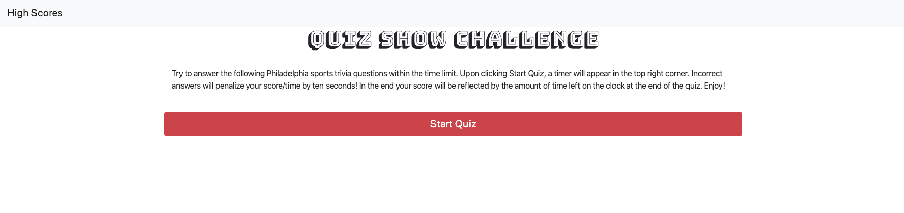
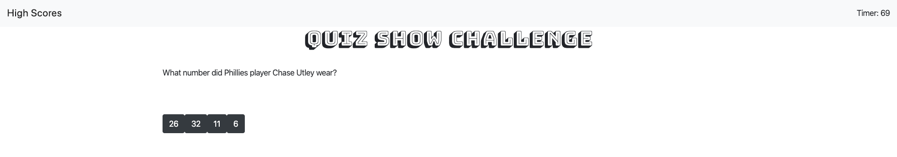

# Quiz-Show

1) Goals and Methods
- Using HTML, CSS and JavaScript, I have created a quiz challenge that puts your mind to the test! As the quiz begins, a timer starts. Each wrong answer takes time off the clock. In the end, your score is stored within the High Scores page. Do you have what it takes to take the top spot?

2) Technologies
- HTML
- CSS
- Javascript

3) Installation: 
- None required

Link to website: https://ksmera01.github.io/Quiz-Show/

